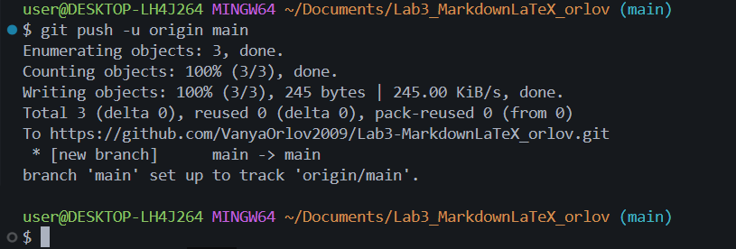

# Лабораторная работа №3. Markdown и LaTeX

## Краткое описание

Цель лабораторной работы - освоить синтаксис Markdown и основы записи формул в LaTeX. В ходе работы создаются файлы с форматированием текста, кодом, таблицами, цитатами и формулами, а также выполняется работа с Git и GitHub.

## Содержание

- [Структура проекта](#структура-проекта)
- [Заголовки](#заголовки)
- [Горизонтальная линия](#горизонтальная-линия)
- [Форматирование текста](#форматирование-текста)
- [Списки](#списки)
- [Цитата](#цитата)
- [Блок кода](#блок-кода)
- [Таблица](#таблица)
- [Изображение](#изображение)
- [Ссылки](#ссылки)
- [Чекбоксы](#чекбоксы)
- [Сноска](#сноска)
- [Alert-блоки GitHub](#alert-блоки-github)
- [LaTeX-формулы](#latex-формулы)

## Структура проекта

- Файлы проекта
  - `README.md` - описание проекта
  - `codeQuotesLab3_Leontev.md` - код и цитаты
  - `tablesLab3_Leontev.md` - таблицы
  - `advancedMarkdownLab3_Leontev.md` - расширенные возможности
  - `latexLab3_Leontev.md` - формулы
- Папка `img/`
  - скриншоты заданий

## Заголовки

Примеры заголовков трёх уровней:

```markdown
# Заголовок 1
## Заголовок 2
### Заголовок 3
```

### Заголовок третьего уровня

Этот раздел оформлен заголовком H3.

## Горизонтальная линия

Текст выше линии

---

Текст ниже линии

## Форматирование текста

- **полужирный**
- *курсив*
- ~~зачёркнутый~~
- `моноширинный`

## Списки

- маркированный
  - вложенный маркированный

1. нумерованный
   1. вложенный нумерованный
2. второй пункт

## Цитата

> Git - это распределённая система контроля версий, созданная для разработки ядра Linux.

## Блок кода

```bash
git add .
git commit -m "Add README"
git push
```

## Таблица

| Функция              | Команда Git    | Описание                    |
|:---------------------|:--------------:|----------------------------:|
| Создание репозитория | **git init**   | Инициализация репозитория   |
| Просмотр состояния   | **git status** | Показывает изменённые файлы |
| Отправка на GitHub   | **git push**   | Загружает коммиты на сервер |

## Изображение



## Ссылки

- Внешняя: [Markdown Guide](https://www.markdownguide.org/ "Перейти на официальный сайт")
- Внутренняя: [Вернуться к содержанию](#содержание)

## Чекбоксы

- [x] Task 1
- [ ] Task 2

## Сноска

Markdown полезен в разработке[^1].

## Alert-блоки GitHub

> [!NOTE]
> Полезная информация, которую стоит учитывать.

> [!TIP]
> Совет: используйте `Ctrl+Shift+V` для предпросмотра в VS Code.

> [!WARNING]
> Критически важная информация: не коммитьте папки `bin/` и `obj/`.

## LaTeX-формулы

### Inline LaTeX

Площадь круга: $S = \pi r^2$

### Block LaTeX

$$
\sum_{i=1}^{n} i = \frac{n(n+1)}{2}
$$

---

[^1]: Синтаксис Markdown поддерживается на GitHub, GitLab и в большинстве редакторов кода.